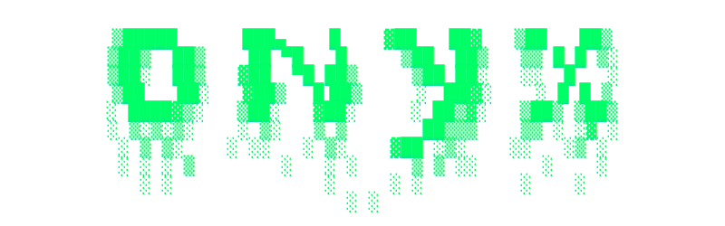

<div align="center">
  
  
  <h1>Onyx-p2p Protocol</h1>
  <p><strong>A zero-trust, perfectly forward-secret P2P terminal chat and file transfer engine.</strong></p>
  
  <p>
    <a href="https://www.rust-lang.org/"></a>
    <a href="https://github.com/bijanmurmu/Onyx-p2p/releases"></a>
    <a href="https://www.gnu.org/licenses/gpl-3.0"></a>
  </p>
</div>

---

## 🔒 Overview

**Onyx-p2p** is a purely decentralized, peer-to-peer terminal communication tool built from the ground up for extreme security environments. By completely bypassing central servers, Onyx-p2p establishes a direct TCP socket between you and your peer, wrapped in military-grade, post-quantum cryptography. 

Whether you are sharing highly sensitive files or having a private conversation, Onyx-p2p ensures your data remains cryptographically isolated, instantly wiped from memory, and mathematically unrecoverable.

---

## ⚡ Core Features

* **Hybrid PQC Handshake**: Uses X25519 and ML-KEM-768 (Post-Quantum) for unbreakable forward secrecy.
* **Symmetric Double Ratchet**: Implements HKDF chain-key ratcheting to cryptographically rotate the key on *every single message sent*.
* **Hardware-Optimized Ciphers**: Automatically negotiates AES-256-GCM (hardware) or ChaCha20-Poly1305 (software).
* **Cryptographic Isolation**: HKDF splits keys for chat, files, and noise.
* **DPI Evasion**: Handshakes are encrypted natively to bypass Deep Packet Inspection.
* **Immutable Memory Wiping**: Passwords are wiped from RAM instantly (`0x00`) using `zeroize`.
* **Traffic Padding**: Background "noise" packets disrupt ISP metadata analysis.
* **Duress Decoy Mode**: Entering a fake password (`decoy`) safely simulates a fake secure session.
* **Panic Button**: Pressing `ESC` instantly wipes the screen and kills the connection.
* **Anti-Screenshot Shield**: Native OS hooks block screen recording and screenshot tools from capturing the app window.
* **Single Packet Authorization (SPA)**: Port knocking implemented at the application layer. The host drops all connections instantly unless the exact cryptographic HMAC is provided on the first byte, making it invisible to Nmap and port scanners.
* **Flawless TLS Masquerading**: Entire transport layer is wrapped in native TLS 1.3 `0x16 0x03` and `0x17 0x03` frames, making Onyx-p2p physically indistinguishable from standard HTTPS traffic to ISP deep packet inspection systems.
* **Keystroke Cadence Obfuscation**: Injects random cryptographic delays (50-300ms) to defeat AI timing attacks analyzing your typing speed.
* **Auto-Destructing Messages**: Use `/ephemeral <seconds>` to sync a self-destruct timer that mathematically wipes the active screen.

---

### 🧩 What it does (In Simple Words)

* **Direct Connection:** Chat and share files without central servers or logs.
* **Easy Setup:** Just agree on a secret password. Onyx-p2p handles the rest.
* **Total Privacy:** Hides your activity from your internet provider using fake noise.
* **Tamper-Proof:** Drops connection instantly if hackers try to peek or alter messages.
* **Leaves No Trace:** Keys are destroyed from RAM the exact moment you close the app.
* **Auto-Destruct:** Enable ephemeral mode to automatically wipe the screen on both ends after reading a message.
* **Invisible to Screen Recorders:** The app's window is mathematically blocked from being captured by screenshots, Snipping Tool, or screen recorders (Windows).
* **Unlimited Sharing:** Send huge files directly without cloud storage limits.
* **Future-Proof:** Protected against futuristic quantum computer attacks.
* **Panic Ready:** Press `ESC` to instantly wipe the screen and disconnect.

### ⚠️ Known Limitations

* **IP Address Exposure**: Direct P2P exposes your public IP. No Tor is used to keep file transfers lightning-fast.
* **Simultaneous Online**: Both users must be online. No servers means no offline messaging.
* **No Chat History**: Past chats cannot be recovered once the app is closed.

---

## 🚀 Installation

Ensure you have the latest version of [Rust and Cargo](https://rustup.rs/) installed on your machine.

**1. Clone the repository**
```bash
git clone https://github.com/bijanmurmu/Onyx-p2p.git
cd Onyx-p2p
```

**2. Fetch dependencies**
```bash
cargo fetch
```

**3. Build the highly-optimized release binary**

> **Linux / macOS**
> ```bash
> cargo build --release
> ./target/release/onyx-p2p
> ```

> **Windows**
> ```powershell
> cargo build --release
> .\target\release\onyx-p2p.exe
> ```

---

## 💻 Usage Guide

Once compiled, run the `onyx-p2p` binary to launch the interactive terminal UI.

### 📡 Hosting a Session
1. Select `[1] Host a secure node` from the main menu.
2. Enter your Alias and a **Secret Password**.
3. Provide your IP Address and the exact Secret Password to your peer over a secure side-channel.

### 🔗 Connecting to a Session
1. Select `[2] Connect to a node` from the main menu.
2. Enter the Host's IP Address.
3. Enter the exact same **Secret Password**.

### 📁 Transferring Files
Once a secure connection is established, you can safely stream files of any size directly to your peer. Just type the `/send` command followed by the absolute path to your file:

```bash
/send C:\absolute\path\to\your\file.zip
```
> *Note: The peer must actively type `/accept` or `/deny` to authorize the incoming transfer.*

---

## 📜 License

This project is licensed under the GNU General Public License v3.0 - see the [LICENSE](LICENSE) file for details.

<div align="center">
  <p><em>Engineered with uncompromising security by Bijan Murmu.</em></p>
</div>
